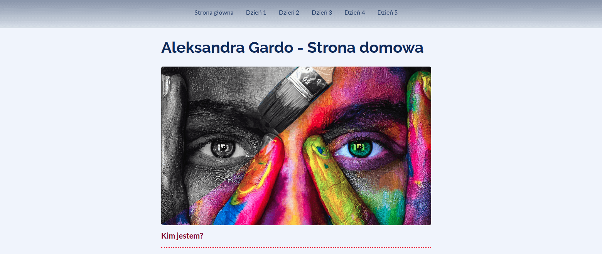

# Mój homepage

Zapraszam na moją stronę [Strona domowa Aleksandry Gardo](https://atanvarde.github.io/homepage-gulp).  

Stanowi ona jeden z projektów zbudowanych podczas 12-tygodniowego kursu podstaw dla frontend developerów  
**WTF Co ten frontend**.

## Użyte narzędzia i technologie

- HTML5, CSS3, JS ES6
- Visual Studio Code
- GULP (Task runner)

## Jak uruchomić moją stronę lokalnie

Aby uruchomić moją stronę lokalnie wykonaj poniższe kroki:

`npm install -g gulp-cli`

`npm install`

`gulp`

To publish your page using github pages use `npm run deploy`

